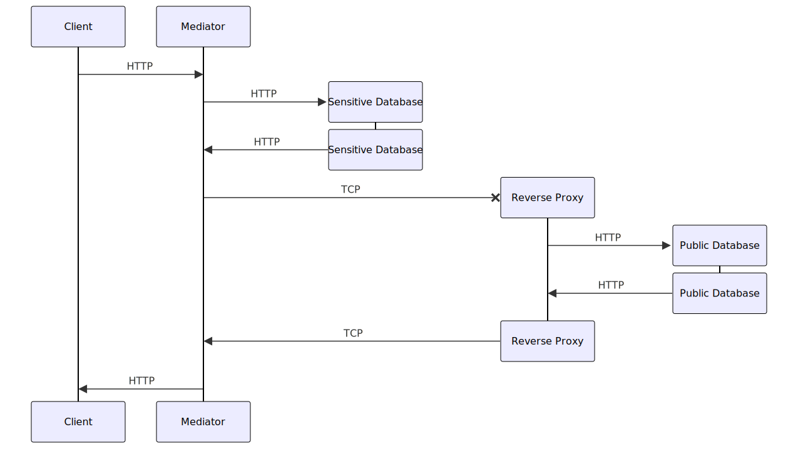
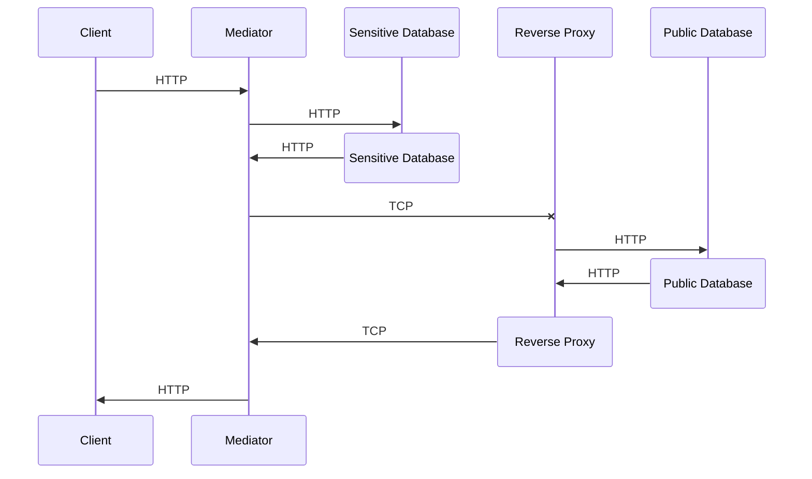

# Service Architecture Project

This repo describes the architecture and design on a service based architecture used to seperate sensitive data from other data.

## Components
- Client: [https://github.com/SHerlihy/auth-frontend](https://github.com/SHerlihy/auth-frontend)
- Mediator: [https://github.com/SHerlihy/auth-mediator-sfg](https://github.com/SHerlihy/auth-mediator-sfg)
- Sensitive Database: [https://github.com/SHerlihy/auth-service-sfg](https://github.com/SHerlihy/auth-service-sfg) [https://github.com/SHerlihy/auth-db](https://github.com/SHerlihy/auth-db)
- Public Database: [https://github.com/SHerlihy/profile-service-rfg](https://github.com/SHerlihy/profile-service-rfg) [https://github.com/SHerlihy/profile-db](https://github.com/SHerlihy/profile-db)

## Current Network Flow

### Flow

### Sequence

